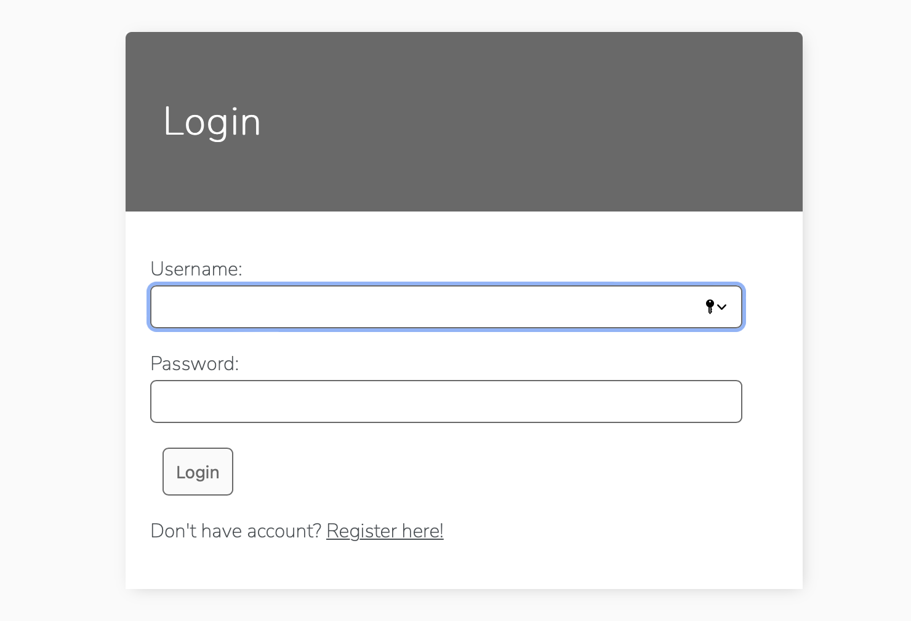
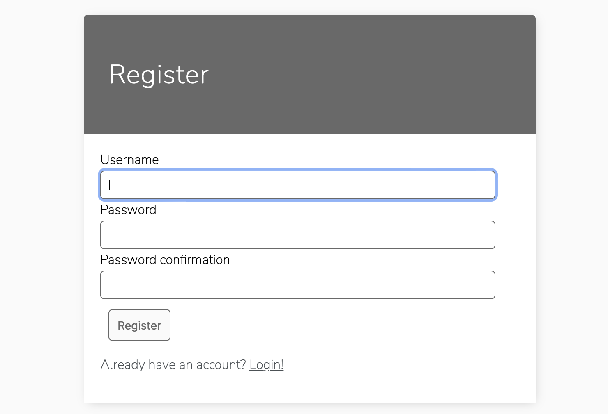
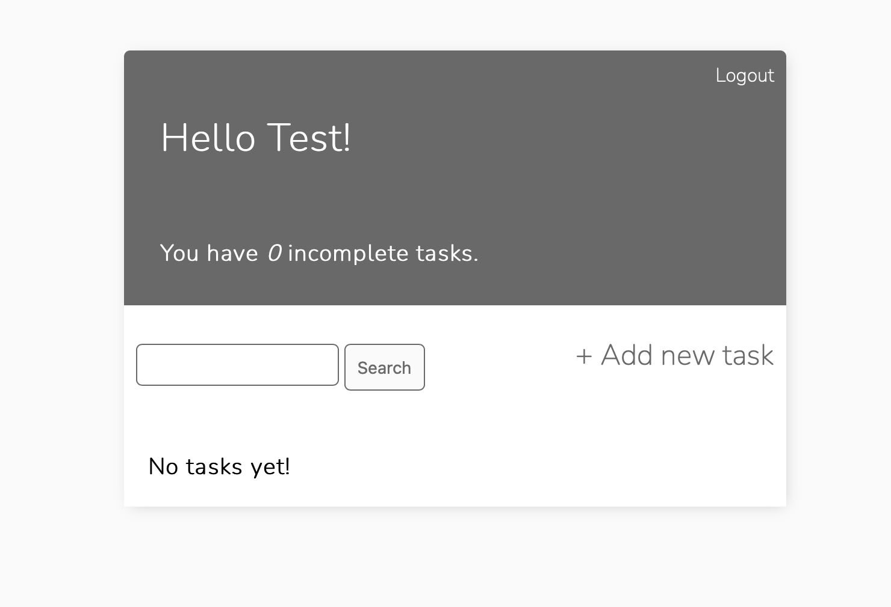
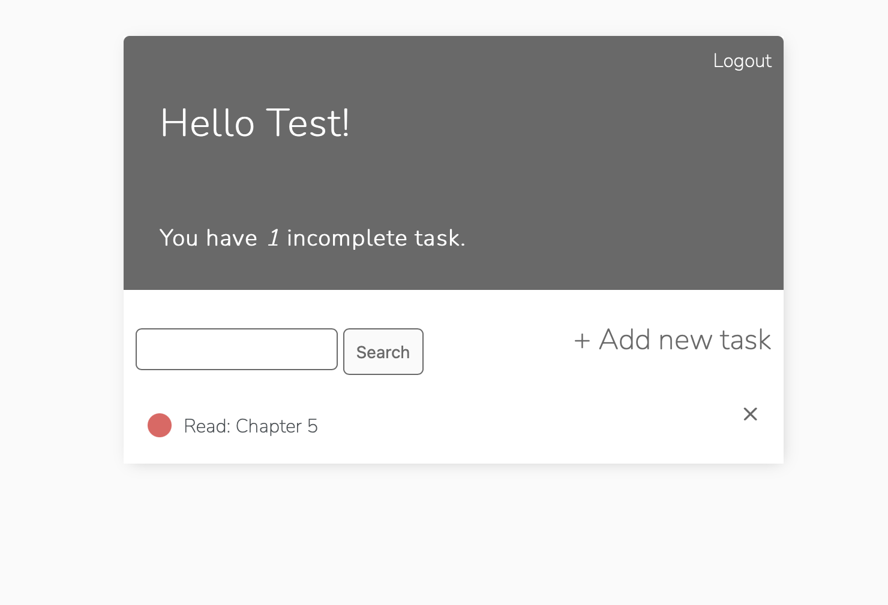
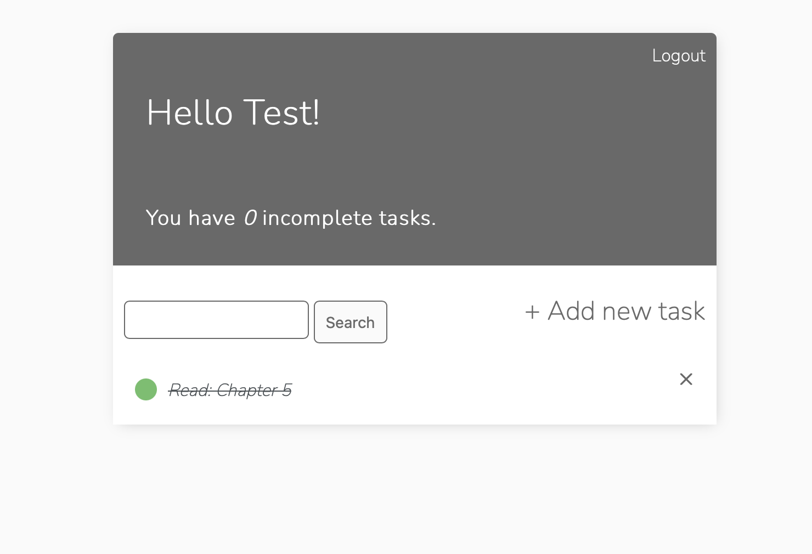
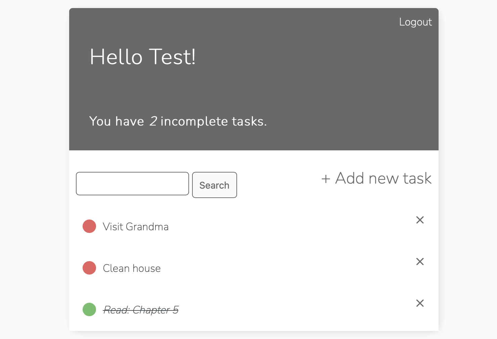
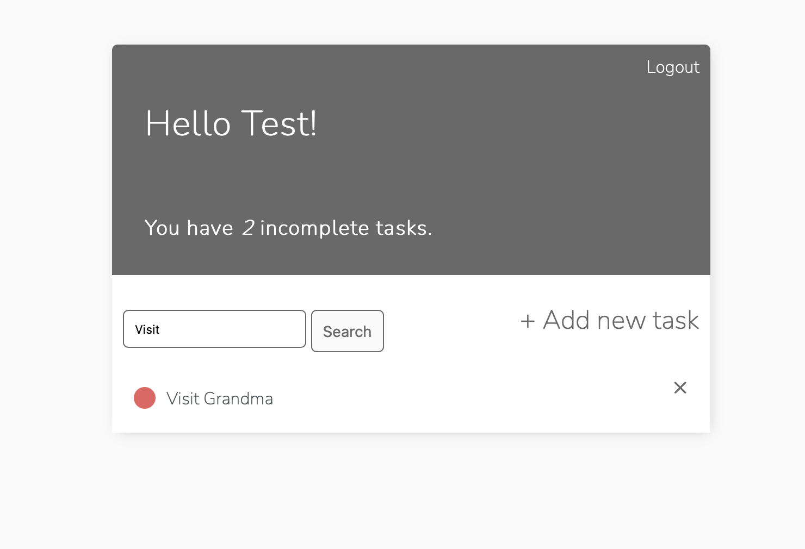

# To-Do-App
To Do list app with User Registration, Login, Search and full Create Read Update and deleet functionality.

# Login/Register new account
* You can create an account and add your tasks:

* Your password must contain a capital letter and a special character!! (example: username-test, password-Pass123!):

# Home page
* Home page view with out tasks:

* You can add tasks by filling in the form:

* Home page with task:

* When you finish the task you can click on the task and mark it as finished:

* You can filter the tasks by entering a search phrase in the search bar:
Home page before adding filter:

After typing the phrase in the search bar

